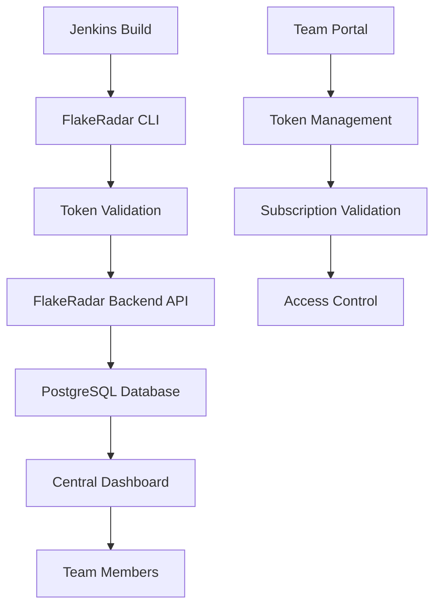

# FlakeRadar Jenkins Integration Guide

## 🎯 Overview

FlakeRadar seamlessly integrates with Jenkins CI/CD pipelines to automatically update your team's central dashboard with every build. This guide explains the complete flow from token acquisition to viewing centralized results.

## 🔑 Token System & Authentication Flow

### **1. Token Acquisition Process**

#### **Step 1: Create Team Account**
```bash
# Visit FlakeRadar team portal
https://api.flakeradar.io/signup

# Create team account with:
- Team name (e.g., "Engineering Team")
- Organization name (e.g., "ACME Corp")
- Plan selection (TEAM or ENTERPRISE)
```

#### **Step 2: Get Team Token**
```bash
# After account creation, you'll receive:
FLAKERADAR_TOKEN="flake_tk_abc123def456ghi789"

# This token provides:
✅ Team collaboration features
✅ Central dashboard access  
✅ Cross-environment analysis
✅ Real-time notifications
✅ Jenkins CI/CD integration
```

### **2. Authentication Architecture**



#### **Token Validation Flow**
1. **Token Submission**: Jenkins sends `FLAKERADAR_TOKEN` with test data
2. **Backend Validation**: API validates token against subscription database
3. **Authorization Check**: Verifies team permissions and active subscription
4. **Data Storage**: Test results stored in team's isolated database partition
5. **Dashboard Update**: Central dashboard updates in real-time
6. **Team Notification**: All team members see the new results

### **3. Data Storage Architecture**

#### **Central Backend Infrastructure**
```
FlakeRadar Backend (api.flakeradar.io)
├── Authentication Service (JWT + API Keys)
├── Multi-Tenant Database (PostgreSQL)
│   ├── Organizations Table
│   ├── Teams Table  
│   ├── Test Executions Table
│   ├── Team Members Table
│   └── Dashboard Metrics Table
├── Real-Time Notification Service
├── Dashboard Web Interface
└── API Gateway (Rate Limiting + Security)
```

#### **Database Schema**
```sql
-- Organizations (top-level isolation)
CREATE TABLE organizations (
    id UUID PRIMARY KEY,
    name VARCHAR(255) NOT NULL,
    subscription_tier VARCHAR(50),
    created_at TIMESTAMP DEFAULT NOW()
);

-- Teams (within organizations)
CREATE TABLE teams (
    id UUID PRIMARY KEY,
    organization_id UUID REFERENCES organizations(id),
    team_id VARCHAR(100) NOT NULL,
    api_token VARCHAR(255) UNIQUE NOT NULL,
    created_at TIMESTAMP DEFAULT NOW()
);

-- Test executions (team-isolated data)
CREATE TABLE test_executions (
    id UUID PRIMARY KEY,
    team_id UUID REFERENCES teams(id),
    project VARCHAR(255) NOT NULL,
    environment VARCHAR(100) NOT NULL,
    test_name VARCHAR(500) NOT NULL,
    status VARCHAR(50) NOT NULL,
    execution_time TIMESTAMP NOT NULL,
    build_id VARCHAR(255),
    commit_sha VARCHAR(255),
    jenkins_job VARCHAR(255),
    jenkins_build INTEGER,
    contributor VARCHAR(255),
    created_at TIMESTAMP DEFAULT NOW()
);

-- Dashboard metrics (aggregated team data)
CREATE TABLE dashboard_metrics (
    id UUID PRIMARY KEY,
    team_id UUID REFERENCES teams(id),
    project VARCHAR(255),
    total_runs INTEGER DEFAULT 0,
    total_tests INTEGER DEFAULT 0,
    flaky_tests_count INTEGER DEFAULT 0,
    last_updated TIMESTAMP DEFAULT NOW()
);
```

## 🏗️ Jenkins Integration Setup

### **1. Add Token to Jenkins**

#### **Option A: Global Environment Variable**
```groovy
// In Jenkins Global Configuration
pipeline {
    environment {
        FLAKERADAR_TOKEN = credentials('flakeradar-team-token')
    }
    // ... rest of pipeline
}
```

#### **Option B: Pipeline Credentials**
```groovy
pipeline {
    stages {
        stage('Test') {
            steps {
                withCredentials([string(credentialsId: 'flakeradar-token', variable: 'FLAKERADAR_TOKEN')]) {
                    // Run tests and FlakeRadar analysis
                    sh '''
                        mvn test
                        flakeradar --project "${JOB_NAME}" --environment "${ENVIRONMENT}" --results "target/surefire-reports/*.xml"
                    '''
                }
            }
        }
    }
}
```

### **2. Jenkins Environment Auto-Detection**

FlakeRadar automatically detects Jenkins and extracts relevant build information:

```bash
# Jenkins Environment Variables Used:
JENKINS_URL          # Jenkins server URL
JOB_NAME            # Jenkins job name  
BUILD_NUMBER        # Jenkins build number
BUILD_URL           # Direct link to Jenkins build
WORKSPACE           # Jenkins workspace path
GIT_BRANCH          # Git branch being built
GIT_COMMIT          # Git commit SHA
BUILD_USER          # User who triggered build
BUILD_DURATION      # Build duration in milliseconds
BUILD_STATUS        # Build result (SUCCESS/FAILURE/UNSTABLE)
```

### **3. Complete Jenkins Pipeline Example**

```groovy
pipeline {
    agent any
    
    environment {
        FLAKERADAR_TOKEN = credentials('flakeradar-team-token')
        ENVIRONMENT = "${env.BRANCH_NAME == 'main' ? 'production' : 'staging'}"
    }
    
    stages {
        stage('Checkout') {
            steps {
                git branch: '${BRANCH_NAME}', 
                    url: 'https://github.com/yourorg/yourapp.git'
            }
        }
        
        stage('Build') {
            steps {
                sh 'mvn clean compile'
            }
        }
        
        stage('Test') {
            steps {
                sh 'mvn test'
            }
            post {
                always {
                    // Publish test results to Jenkins
                    publishTestResults testResultsPattern: 'target/surefire-reports/*.xml'
                    
                    // Automatically update FlakeRadar team dashboard
                    sh '''
                        flakeradar \
                            --project "${JOB_NAME}" \
                            --environment "${ENVIRONMENT}" \
                            --results "target/surefire-reports/*.xml"
                    '''
                }
            }
        }
    }
    
    post {
        always {
            // Archive test reports
            archiveArtifacts artifacts: 'flakeradar_report.html', 
                            allowEmptyArchive: true
        }
        success {
            echo "✅ Build successful - team dashboard updated"
        }
        failure {
            echo "❌ Build failed - results still sent to team dashboard"
        }
    }
}
```

### **4. Jenkins Output Example**

```bash
🏗️  Jenkins detected: backend-api-tests build #127
   🌍 Environment: staging
   🔗 Build URL: https://jenkins.company.com/job/backend-api-tests/127/

📊 Test Analysis Results:
┌─────────────────────────────────┬──────┬──────┬───────┬───────┬──────┬─────────┐
│ Test                           │ Pass │ Fail │ Total │ Trans │ Rate │ Flaky?  │
├─────────────────────────────────┼──────┼──────┼───────┼───────┼──────┼─────────┤
│ UserLoginTest#validateAuth     │   18 │    2 │    20 │    3  │ 10%  │ ✅ (76%) │
│ DatabaseTest#connectionPool    │   15 │    5 │    20 │    7  │ 25%  │ ✅ (84%) │
└─────────────────────────────────┴──────┴──────┴───────┴───────┴──────┴─────────┘

🏢 Team Insights (staging environment):
  • Total team flaky tests: 23
  • Cross-environment issues: 8
  • Team members affected: 5
  • 🌐 Team Dashboard: https://api.flakeradar.io/dashboard/engineering-team
  • 👥 Active Contributors: 5
  • 📈 Recent Activity:
    - jenkins-user ran 47 tests in staging (just now)
    - alice ran 23 tests in production (2 hours ago)

🔔 Team dashboard updated - results visible to all team members
🏗️  Jenkins build #127 results now in team dashboard
📊 View team insights: https://api.flakeradar.io/dashboard/engineering-team?project=backend-api-tests
```

## 🌐 Viewing Central Dashboard

### **1. Web Dashboard Access**

#### **Team Dashboard URL Structure**
```bash
# Main team dashboard
https://api.flakeradar.io/dashboard/{TEAM_ID}

# Project-specific dashboard  
https://api.flakeradar.io/dashboard/{TEAM_ID}?project={PROJECT_NAME}

# Jenkins-optimized view
https://api.flakeradar.io/jenkins-dashboard/{TEAM_ID}?project={PROJECT_NAME}

# Organization-wide dashboard
https://api.flakeradar.io/dashboard/{TEAM_ID}?org={ORG_NAME}
```

#### **Dashboard Features**
- **📊 Real-Time Metrics**: Live updates when any team member runs tests
- **🏗️ Jenkins Integration**: See all Jenkins builds and their test results
- **🌍 Environment Comparison**: Compare flakiness across staging/prod/dev
- **👥 Team Activity**: Real-time feed of who ran tests when
- **📈 Trends**: Historical flakiness trends over time
- **🔴 Top Offenders**: Most problematic flaky tests across all environments

### **2. Programmatic Dashboard Access**

```python
from flakeradar import FlakeRadar

# Access team dashboard programmatically
with FlakeRadar(
    team_id="engineering-team",
    api_token="flake_tk_your_token"
) as radar:
    # Get central dashboard data
    dashboard = radar.get_team_dashboard()
    print(f"📊 Total team runs: {dashboard['total_runs']}")
    print(f"🏗️ Jenkins builds: {len(dashboard['jenkins_builds'])}")
    
    # Get Jenkins-specific data
    jenkins_builds = radar.get_team_backend().get_jenkins_builds("your-project")
    for build in jenkins_builds:
        print(f"Build #{build['build_number']}: {build['test_count']} tests")
    
    # Get dashboard URL for sharing
    dashboard_url = radar.get_dashboard_url("your-project")
    print(f"🌐 Dashboard: {dashboard_url}")
```

### **3. CLI Dashboard Access**

```bash
# View team dashboard info in CLI
export FLAKERADAR_TOKEN="flake_tk_your_token"
flakeradar --project "MyApp" --environment staging --results "*.xml"

# Output includes dashboard link:
# 🌐 Team Dashboard: https://api.flakeradar.io/dashboard/engineering-team
```

## 🔒 Security & Access Control

### **1. Token Security**

#### **Token Characteristics**
- **Format**: `flake_tk_` prefix + 32-character alphanumeric string
- **Scope**: Team-level access to specific organization data
- **Rotation**: Tokens can be rotated without downtime
- **Expiration**: Tokens expire based on subscription status

#### **Security Best Practices**
```bash
# ✅ Store in Jenkins credentials
credentials('flakeradar-team-token')

# ✅ Use environment variables
export FLAKERADAR_TOKEN="${FLAKERADAR_TOKEN}"

# ❌ Never hardcode in pipeline
FLAKERADAR_TOKEN="flake_tk_hardcoded_token"  # DON'T DO THIS

# ✅ Rotate tokens regularly
# Visit https://api.flakeradar.io/team/tokens to rotate
```

### **2. Data Isolation**

#### **Multi-Tenant Security**
- **Organization Isolation**: Each organization's data is completely isolated
- **Team Boundaries**: Teams within organizations have separate data access
- **Project Segmentation**: Projects can be filtered for role-based access
- **Environment Separation**: Production/staging data kept separate

#### **Access Control Matrix**
| Role | Dashboard Access | Token Management | Data Export | Admin Functions |
|------|-----------------|------------------|-------------|-----------------|
| **Team Member** | ✅ Read | ❌ No | ✅ Own Projects | ❌ No |
| **Team Admin** | ✅ Full | ✅ Rotate/Create | ✅ All Projects | ✅ Limited |
| **Org Admin** | ✅ All Teams | ✅ Full | ✅ All Data | ✅ Full |

## 📊 Dashboard Features & Views

### **1. Main Team Dashboard**

#### **Overview Section**
- **📊 Key Metrics**: Total runs, tests, flaky tests, success rate
- **📈 Trend Charts**: Flakiness trends over time by environment
- **🏗️ Jenkins Status**: Recent builds and their test results
- **👥 Team Activity**: Real-time feed of team member activities

#### **Jenkins Integration Panel**
```javascript
{
  "jenkins_builds": [
    {
      "job_name": "backend-api-tests",
      "build_number": 127,
      "build_url": "https://jenkins.company.com/job/backend-api-tests/127/",
      "triggered_by": "jenkins-user",
      "environment": "staging",
      "test_count": 47,
      "flaky_count": 3,
      "build_status": "SUCCESS",
      "timestamp": "2025-07-21T10:30:00Z"
    }
  ]
}
```

### **2. Environment Comparison View**

| Environment | Total Tests | Flaky Tests | Flakiness Rate | Last Updated |
|-------------|-------------|-------------|----------------|--------------|
| 🟢 **Production** | 1,234 | 12 | 0.97% | 2 hours ago |
| 🟡 **Staging** | 1,187 | 45 | 3.79% | 30 min ago |
| 🔴 **Development** | 987 | 78 | 7.90% | 5 min ago |

### **3. Team Member Activity Feed**

```
📈 Recent Team Activity:
  • jenkins-user (Jenkins) analyzed 47 tests in staging (2 minutes ago)
    └─ Build #127: backend-api-tests
    └─ 3 flaky tests detected
  
  • alice analyzed 23 tests in production (2 hours ago)
    └─ Manual run: critical-path-tests
    └─ 1 flaky test detected
  
  • bob analyzed 31 tests in development (4 hours ago)
    └─ Feature branch: user-auth-refactor
    └─ 5 flaky tests detected
```

## 🚀 Advanced Integration Patterns

### **1. Multi-Project Jenkins Setup**

```groovy
// For organizations with multiple projects
pipeline {
    environment {
        FLAKERADAR_TOKEN = credentials('flakeradar-team-token')
        PROJECT_NAME = "${JOB_NAME.split('/')[0]}"  // Extract project from job path
        ENVIRONMENT = "${env.BRANCH_NAME == 'main' ? 'production' : 'staging'}"
    }
    
    post {
        always {
            sh '''
                flakeradar \
                    --project "${PROJECT_NAME}" \
                    --environment "${ENVIRONMENT}" \
                    --results "**/target/surefire-reports/*.xml"
            '''
        }
    }
}
```

### **2. Matrix Build Integration**

```groovy
// For matrix builds across multiple environments
pipeline {
    axes {
        axis {
            name 'ENVIRONMENT'
            values 'staging', 'production', 'integration'
        }
    }
    
    stages {
        stage('Test') {
            steps {
                sh 'mvn test -Denv=${ENVIRONMENT}'
            }
            post {
                always {
                    sh '''
                        flakeradar \
                            --project "${JOB_NAME}" \
                            --environment "${ENVIRONMENT}" \
                            --results "target/surefire-reports/*.xml"
                    '''
                }
            }
        }
    }
}
```

### **3. Conditional Analysis**

```groovy
// Only run FlakeRadar on specific conditions
pipeline {
    post {
        always {
            script {
                if (env.BRANCH_NAME == 'main' || env.CHANGE_ID) {
                    sh '''
                        echo "Running FlakeRadar analysis for main branch or PR"
                        flakeradar \
                            --project "${JOB_NAME}" \
                            --environment "${ENVIRONMENT}" \
                            --results "target/surefire-reports/*.xml"
                    '''
                } else {
                    echo "Skipping FlakeRadar analysis for feature branch"
                }
            }
        }
    }
}
```

## 🎯 Benefits Summary

### **For Development Teams**
- **🔄 Automatic Updates**: Every Jenkins build updates team dashboard
- **🌐 Unified View**: See all team test results in one place
- **📊 Historical Tracking**: Track flakiness trends over time
- **👥 Team Coordination**: Know what others are testing and when

### **For DevOps/CI Teams**
- **🏗️ Jenkins Integration**: Zero-configuration setup with environment detection
- **📈 Pipeline Insights**: Understand test stability across all builds
- **🚨 Early Warning**: Spot flakiness trends before they become critical
- **📊 Metrics Dashboard**: Executive-level visibility into test quality

### **For QA Teams**
- **🎯 Prioritization**: Focus on tests that affect multiple environments
- **🔍 Root Cause Analysis**: AI-powered insights into failure patterns
- **📋 Test Planning**: Data-driven decisions on test improvements
- **🤝 Collaboration**: Share insights with development and operations teams

## ✅ Implementation Checklist

### **Team Setup**
- [ ] Create FlakeRadar team account at `api.flakeradar.io`
- [ ] Generate team token: `FLAKERADAR_TOKEN`
- [ ] Share token with team members
- [ ] Configure organization and team settings

### **Jenkins Configuration**
- [ ] Add token to Jenkins credentials store
- [ ] Update pipeline to use FlakeRadar token
- [ ] Configure environment variables (staging/prod/dev)
- [ ] Test integration with sample build

### **Dashboard Access**
- [ ] Bookmark team dashboard URL
- [ ] Train team on dashboard features
- [ ] Set up notification preferences
- [ ] Configure project-specific views

### **Validation**
- [ ] Run test build and verify dashboard update
- [ ] Check team member activity feed
- [ ] Validate cross-environment insights
- [ ] Confirm Jenkins build linkage

**🎉 Ready for enterprise-scale Jenkins + FlakeRadar collaboration!**
