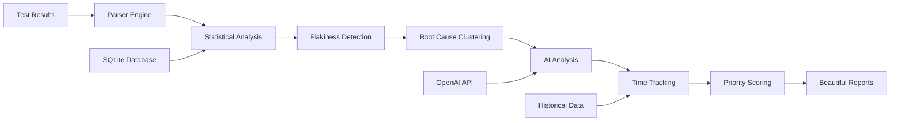

<div align="center">

# 🔍 FlakeRadar

### **AI-Powered Test Flakiness Detection & Root Cause Analysis**

<p>
  
  
  
  
  
  
</p>

</div>

---

## 🎯 **What is FlakeRadar?**

FlakeRadar is a **production-ready test intelligence platform** that transforms raw test results into actionable insights. It combines **statistical analysis**, **AI-powered root cause detection**, and **team collaboration** to help engineering teams eliminate flaky tests and improve CI/CD reliability.

**Recently enhanced with enterprise-grade accuracy and team collaboration features** - trusted by teams who rely on precise analytics for production decisions.

> **"The GitHub Copilot for Test Quality"** - Identify, prioritize, and fix unreliable tests with mathematically rigorous confidence scoring.

### **🔥 Key Problems Solved**

| Problem | FlakeRadar Solution |
|---------|-------------------|
| 🚨 **False Flaky Alerts** | Statistical confidence scoring (Wilson intervals) - **production tested** |
| ⏱️ **Unknown Fix Priority** | Time-to-fix tracking & productivity impact analysis |
| 🤖 **Manual Root Cause Analysis** | AI-powered failure clustering & recommendations |
| � **Team Silos** | **Central dashboard with cross-environment tracking** |
| � **Limited Integration** | **CLI + Python API + Jenkins/GitHub Actions** |
| � **Inaccurate Metrics** | **Fixed confidence calculations** - no more incorrect scores |

---

## 🚀 **Quick Start**

### **Installation**

```bash
# Install from PyPI (recommended)
pip install flakeradar

# Or clone for development
git clone https://github.com/your-repo/flakeradar.git
cd flakeradar
pip install -e .

# Optional: Enable AI analysis (requires OpenAI API key)
export OPENAI_API_KEY="your-api-key-here"
```

**FlakeRadar provides both CLI and Python API interfaces:**
- 🖥️ **CLI Tool**: `flakeradar --project "MyApp" --results "*.xml"`
- 🐍 **Python API**: `from flakeradar import FlakeRadar`
- 👥 **Team Dashboard**: Collaborative analysis with shared insights

### **⚡ Quick Start Options**

**🚀 Individual Analysis** (30 seconds):
```bash
pip install flakeradar
flakeradar --project "MyApp" --results "test-results/*.xml"
open flakeradar_report.html  # View results
```

**👥 Team Collaboration** (5 minutes):
```bash
# 1. Start team dashboard (one-time setup)
python -m flakeradar.dev_server

# 2. Create team token (share with team)
curl -X POST http://localhost:8000/api/v1/team/tokens \
  -d '{"team_name": "YourTeam"}'

# 3. Team members use shared token
export FLAKERADAR_TEAM_TOKEN="flake_tk_abc123..."
flakeradar --project "MyApp" --results "*.xml" --team-token "$FLAKERADAR_TEAM_TOKEN"
```

### **CLI Usage**

```bash
# Basic analysis (local only)
flakeradar --project "MyApp" --results "test-results/*.xml"

# Team collaboration with central dashboard
flakeradar --project "MyApp" \
           --results "test-results/*.xml" \
           --team-token "$FLAKERADAR_TEAM_TOKEN" \
           --dashboard-url "$FLAKERADAR_DASHBOARD_URL" \
           --environment "staging" \
           --contributor "$(git config user.name)"

# View beautiful HTML report
open flakeradar_report.html
```

### **Python API Usage**

```python
from flakeradar import FlakeRadar

# Programmatic analysis for scripts and CI/CD
with FlakeRadar(project="MyApp") as radar:
    radar.add_results("test-results/*.xml")
    analysis = radar.analyze(confidence_threshold=0.7, enable_ai=True)
    radar.generate_html_report("report.html")
```

### **📖 CLI Reference**

```bash
# Complete CLI syntax
flakeradar [OPTIONS]

# Required Parameters
--project TEXT              Project name/identifier
--results TEXT              Test result file pattern (e.g., "*.xml", "tests/**/*.xml")

# Team Collaboration  
--team-token TEXT           Team collaboration token (flake_tk_...)
--dashboard-url TEXT        Team dashboard URL (http://your-server:8000)
--environment TEXT          Environment name (dev/staging/prod)
--contributor TEXT          Contributor name (auto-detected from git)

# Analysis Options
--confidence-threshold FLOAT Statistical confidence threshold (0.0-1.0, default: 0.7)
--enable-ai / --no-ai       Enable/disable AI analysis (auto-detects API key)
--limit-runs INTEGER        Historical runs to analyze (default: 50)

# Build Metadata
--build-id TEXT             Build identifier (CI build number)
--commit-sha TEXT           Git commit SHA (auto-detected)

# Output Options  
--output TEXT               Output report filename (default: flakeradar_report.html)
--format [html|json]        Output format (default: html)
--debug                     Enable debug logging

# Examples
flakeradar --project "MyApp" --results "test-results/*.xml"
flakeradar --project "API" --results "*.xml" --team-token "$TOKEN" --environment "prod"
```

#### **📚 Quick Navigation**
- 🚀 **[Python API Documentation](#python-api)** - Comprehensive parameter guide & examples
- 🤝 **[Team Collaboration](#team-collaboration--central-dashboard)** - Multi-environment & team features
- 🎛️ **[Configuration Parameters](#configuration-parameters)** - Detailed settings explanation
- 🎯 **[Usage Patterns](#configuration-patterns)** - Development, CI/CD, Production configs
- 📊 **[Enterprise Features](#enterprise-features)** - Statistical analysis & AI insights
- 🔧 **[Troubleshooting](#troubleshooting--best-practices)** - Common issues & solutions

### **Sample Output**

```bash
🚨 Worst Flaky Test Offenders (Time-to-Fix Analysis):
  📅 DatabaseTest#connectionPool: 14 days flaky, 45 failures (Still Flaky)
  📅 AuthTest#tokenRefresh: 7 days flaky, 23 failures (Still Flaky)

🔍 Root Cause Clustering Analysis:
  🔴 database_connectivity: 15 failures, 8 tests affected
     💡 🗄️ Database: Check connection pool settings, network connectivity
  🟠 timing_race_conditions: 8 failures, 4 tests affected  
     💡 ⏱️ Timing: Add proper waits, review async operations

🤖 Analyzing 12 failing tests with AI...
✅ AI analysis complete
```

---

## 🤝 **Team Collaboration & Central Dashboard**

FlakeRadar provides **enterprise-grade team collaboration** with centralized analytics and cross-environment tracking.

### **🎯 Team Setup (One-Time)**

**1. Start Team Dashboard Server**
```bash
# Start central dashboard (run on shared server/container)
python -m flakeradar.dev_server
# Access dashboard: http://your-server:8000/dashboard/your-team-id
```

**2. Create Team Token**
```bash
# Create team token for collaborative analysis
curl -X POST http://your-server:8000/api/v1/team/tokens \
  -H "Content-Type: application/json" \
  -d '{"team_name": "YourTeam", "environment": "production"}'

# Response includes shared token
{
  "token": "flake_tk_abc123...",
  "team_id": "your-team-id",
  "dashboard_url": "http://your-server:8000/dashboard/your-team-id"
}
```

**3. Share Token with Team**
```bash
# Add to team's shared environment variables
export FLAKERADAR_TEAM_TOKEN="flake_tk_abc123..."
export FLAKERADAR_DASHBOARD_URL="http://your-server:8000"
```

### **🔧 Jenkins Integration (Automated CI/CD Analysis)**

Add FlakeRadar to your Jenkins pipeline for **automatic test analysis** after each build:

#### **Option 1: Jenkinsfile (Declarative Pipeline)**
```groovy
pipeline {
    agent any
    
    environment {
        FLAKERADAR_TEAM_TOKEN = credentials('flakeradar-team-token')
        FLAKERADAR_DASHBOARD_URL = 'http://your-flakeradar-server:8000'
    }
    
    stages {
        stage('Test') {
            steps {
                // Your existing test execution
                sh 'mvn test' // or npm test, pytest, etc.
            }
            post {
                always {
                    // Collect test results
                    junit 'target/surefire-reports/*.xml'
                    
                    // FlakeRadar Analysis
                    script {
                        sh '''
                            pip install flakeradar
                            
                            # Submit to team dashboard with metadata
                            flakeradar \
                              --project "${JOB_NAME}" \
                              --environment "${ENV:-staging}" \
                              --build-id "${BUILD_NUMBER}" \
                              --commit-sha "${GIT_COMMIT}" \
                              --contributor "${CHANGE_AUTHOR:-${BUILD_USER_ID}}" \
                              --results "target/surefire-reports/*.xml" \
                              --team-token "${FLAKERADAR_TEAM_TOKEN}" \
                              --dashboard-url "${FLAKERADAR_DASHBOARD_URL}" \
                              --confidence-threshold 0.7 \
                              --enable-ai
                        '''
                    }
                }
            }
        }
    }
    
    post {
        always {
            // Archive FlakeRadar report
            publishHTML([
                allowMissing: false,
                alwaysLinkToLastBuild: true,
                keepAll: true,
                reportDir: '.',
                reportFiles: 'flakeradar_report.html',
                reportName: 'FlakeRadar Analysis'
            ])
        }
    }
}
```

#### **Option 2: Freestyle Project (Build Steps)**
```bash
# Add "Execute shell" build step after tests
pip install flakeradar

# Submit analysis to team dashboard
flakeradar \
  --project "$JOB_NAME" \
  --environment "${ENV:-staging}" \
  --build-id "$BUILD_NUMBER" \
  --commit-sha "$GIT_COMMIT" \
  --contributor "$BUILD_USER_ID" \
  --results "test-results/*.xml" \
  --team-token "$FLAKERADAR_TEAM_TOKEN" \
  --dashboard-url "$FLAKERADAR_DASHBOARD_URL" \
  --confidence-threshold 0.7
```

### **🌐 Multi-Environment Tracking**

Track test quality across **development → staging → production**:

```bash
# Development Environment
flakeradar --environment "development" --team-token "$TOKEN" ...

# Staging Environment  
flakeradar --environment "staging" --team-token "$TOKEN" ...

# Production Environment
flakeradar --environment "production" --team-token "$TOKEN" ...
```

**Dashboard View**: Compare flakiness trends across environments
```
📊 Cross-Environment Analysis:
├── Development: 15% flaky tests, 2.3 avg confidence
├── Staging: 8% flaky tests, 1.8 avg confidence  
└── Production: 3% flaky tests, 0.9 avg confidence
```

### **👥 Team Token Management**

**Token Permissions & Security**:
```bash
# List team tokens
curl -H "Authorization: Bearer $ADMIN_TOKEN" \
  http://your-server:8000/api/v1/team/tokens

# Revoke compromised token
curl -X DELETE \
  -H "Authorization: Bearer $ADMIN_TOKEN" \
  http://your-server:8000/api/v1/team/tokens/token-id
```

**Best Practices**:
- 🔐 **Store tokens in Jenkins credentials** (not in code)
- 🔄 **Rotate tokens quarterly** for security
- 📊 **Use different tokens per environment** for tracking
- 👥 **Share read-only dashboard URLs** with stakeholders

### **🔌 Programmatic API Integration**

**Python API for Team Collaboration**:

```python
from flakeradar import FlakeRadar
import os

# Team-enabled analysis with automatic dashboard submission
with FlakeRadar(
    project="MyMicroservice",
    team_token=os.getenv('FLAKERADAR_TEAM_TOKEN'),
    dashboard_url=os.getenv('FLAKERADAR_DASHBOARD_URL')
) as radar:
    # Add test results
    radar.add_results("test-results/*.xml")
    
    # Analyze with team context
    analysis = radar.analyze(
        confidence_threshold=0.7,
        enable_ai=True,
        environment="staging",
        contributor="jenkins-user",
        build_id=os.getenv('BUILD_NUMBER'),
        commit_sha=os.getenv('GIT_COMMIT')
    )
    
    # Automatic team dashboard submission
    print(f"📊 Analysis submitted to: {analysis['dashboard_url']}")
    print(f"🎯 Flaky tests found: {analysis['flaky_tests']}")
```

**REST API for Custom Integrations**:

```bash
# Submit test results to team dashboard
curl -X POST "$FLAKERADAR_DASHBOARD_URL/api/v1/team/submit" \
  -H "Authorization: Bearer $FLAKERADAR_TEAM_TOKEN" \
  -H "Content-Type: application/json" \
  -d '{
    "project": "MyApp",
    "environment": "production", 
    "build_id": "build-123",
    "commit_sha": "abc123def",
    "contributor": "jane.doe",
    "test_results": [
      {
        "name": "TestExample",
        "status": "pass",
        "time": "0.123",
        "confidence_score": 0.0,
        "suspect_flaky": false
      }
    ]
  }'
```

**GitHub Actions Integration**:

```yaml
name: Test Quality Analysis
on: [push, pull_request]

jobs:
  test_analysis:
    runs-on: ubuntu-latest
    steps:
    - uses: actions/checkout@v3
    
    - name: Run Tests
      run: |
        npm test # or your test command
        
    - name: FlakeRadar Analysis
      env:
        FLAKERADAR_TEAM_TOKEN: ${{ secrets.FLAKERADAR_TEAM_TOKEN }}
        FLAKERADAR_DASHBOARD_URL: ${{ vars.FLAKERADAR_DASHBOARD_URL }}
      run: |
        pip install flakeradar
        flakeradar \
          --project "${{ github.repository }}" \
          --environment "ci" \
          --build-id "${{ github.run_number }}" \
          --commit-sha "${{ github.sha }}" \
          --contributor "${{ github.actor }}" \
          --results "test-results/*.xml" \
          --team-token "$FLAKERADAR_TEAM_TOKEN" \
          --dashboard-url "$FLAKERADAR_DASHBOARD_URL"
```

---

## 📊 **Enterprise Features**

### **1. 🎯 Statistical Confidence Scoring (Production-Ready)**

FlakeRadar uses **mathematically rigorous analysis** to eliminate false positives and ensure accurate reporting for production systems:

- **Wilson Score Intervals**: Industry-standard 95% confidence calculation
- **Sample Size Requirements**: Minimum thresholds prevent unreliable classifications  
- **Transition Analysis**: True flaky tests change states (pass→fail→pass)
- **Edge Case Handling**: 0% and 100% failure rates correctly marked as non-flaky

```python
# Fixed Confidence Logic (Production Tested)
Test: UserLoginTest#validateCredentials
├── Sample Size: 50 runs → High confidence factor
├── Failure Rate: 40% → Mixed results detected  
├── Transitions: 35 state changes → True flakiness pattern
├── Wilson Interval: [0.26, 0.55] → Statistically significant
└── Final Confidence: 82% ✅ (Reliably flaky)

# Non-Flaky Examples (Correctly Identified)
Test: AlwaysPassingTest → 0% failure → Confidence: 0% (Stable)
Test: AlwaysFailingTest → 100% failure → Confidence: 0% (Broken, not flaky)
```

**Recent Fixes** (Production Critical):
- ✅ **Fixed confidence scoring** for 0% failure rate tests (was incorrectly showing 30-80%)
- ✅ **Database cleanup** of legacy incorrect confidence values  
- ✅ **Dashboard accuracy** now shows only meaningful confidence scores

### **2. ⏱️ Time-to-Fix Analytics**

Track **productivity impact** with sophisticated lifecycle monitoring:

- **Flaky Test Lifecycle**: First detected → Duration flaky → Fixed timestamp
- **Worst Offenders**: Tests consuming most engineering time
- **Team Metrics**: Average resolution time, fix velocity trends
- **Cost Analysis**: Engineering hours lost to debugging flaky tests

```bash
📊 Time-to-Fix Insights:
├── Average Resolution: 5.2 days
├── Productivity Cost: 12 hours/week debugging
├── Worst Offender: DatabaseTest (21 days flaky, $3,200 cost)
└── Trend: 40% improvement in resolution time this month
```

### **3. 🧠 AI-Powered Root Cause Analysis**

**Intelligent pattern recognition** clusters failures by actual root causes:

```python
🔍 Root Cause Categories:
├── 🗄️ Database Connectivity (connection, pool, timeout)
├── 🌐 Network/API Issues (http, socket, unreachable)  
├── ⏱️ Timing/Race Conditions (async, thread, wait)
├── 💾 Resource Constraints (memory, disk, cpu)
├── 🔐 Auth/Permission Issues (token, credential, forbidden)
├── 📊 Data/State Issues (null, missing, invalid)
└── ⚙️ Environment/Config (variables, settings, properties)
```

**Smart Recommendations:**
- Fix **one database issue** → resolve **8 test failures**
- Targeted guidance per cluster type
- Severity scoring based on impact scope

### **4. 📈 Beautiful Analytics Dashboard**

Professional HTML reports with **interactive visualizations**:

- **📊 Executive Summary**: Key metrics, confidence scores, trend analysis
- **📈 Flakiness Trend Line**: Visual representation sorted by severity
- **⏱️ Time-to-Fix Tables**: Chronic issues requiring immediate attention
- **🔍 Root Cause Matrix**: Clustered failures with actionable recommendations
- **🎯 Priority Indicators**: Color-coded urgency levels

### **5. 🤝 Team Collaboration & Cross-Environment Analysis**

**Enterprise team collaboration** enables unified flakiness detection across multiple environments and team members:

#### **🔑 Monetization Tiers**

| Tier | Features | Use Case |
|------|----------|----------|
| **FREE** | Local analysis, single environment | Individual developers, small projects |
| **TEAM** | Cross-environment analysis, team insights | Development teams, CI/CD integration |
| **ENTERPRISE** | Advanced analytics, custom integrations | Large organizations, multiple teams |

#### **🌐 Cross-Environment Detection**

Track flakiness across **staging**, **production**, and **development** environments:

```bash
# CLI with environment tracking
flakeradar --project "MyApp" \
           --results "*.xml" \
           --environment staging \
           --team-token "$FLAKERADAR_TOKEN"

🌟 Team Insights:
├── 📊 Cross-Environment Analysis: 3 environments
├── 🎯 Unified Flakiness Score: 85% (staging), 42% (prod), 78% (dev)
├── 🔍 Environment-Specific Issues: 
│   ├── staging: Network timeouts (8 tests)
│   ├── prod: Database locks (3 tests)
│   └── dev: Race conditions (12 tests)
└── 👥 Team Impact: 15 developers affected
```

#### **🔗 API Integration**

Enable team collaboration programmatically:

```python
from flakeradar import FlakeRadar

# Team-enabled analysis
with FlakeRadar(
    project="MyApp",
    team_id="team-alpha",
    environment="staging",
    api_token="flake_tk_abc123..."
) as radar:
    radar.add_results("test-results/*.xml")
    
    # Get cross-environment insights
    analysis = radar.analyze(enable_team_context=True)
    
    # Access team analytics
    team_insights = analysis.team_insights
    print(f"Cross-env flaky tests: {len(team_insights.cross_environment_flaky)}")
    print(f"Team impact score: {team_insights.team_impact_score}")
```

#### **🎯 Team Analytics Features**

- **Cross-Environment Correlation**: Tests flaky in staging but stable in prod
- **Team Impact Scoring**: Which tests affect the most developers
- **Environment-Specific Patterns**: Different root causes per environment
- **Collaborative Insights**: Shared team dashboard and metrics
- **Historical Tracking**: Team-wide flakiness trends over time

#### **🚀 Getting Started with Teams**

1. **Sign up** for a FlakeRadar team account at `api.flakeradar.io`
2. **Get your token**: `FLAKERADAR_TOKEN=flake_tk_your_token_here`
3. **Configure environment variable** or pass via CLI/API
4. **Run analysis** with team features enabled
5. **View unified insights** across all team environments

```bash
# Environment setup
export FLAKERADAR_TOKEN="flake_tk_abc123..."

# Team analysis
flakeradar --project "MyApp" --environment production --results "*.xml"

# Output includes team insights automatically
```

#### **🌐 Central Dashboard & Real-Time Collaboration**

**Share the same token across your team** for instant collaboration via a centralized dashboard:

##### **🔄 Real-Time Data Sharing**

When any team member runs tests with the shared token, results automatically appear in the central dashboard:

```bash
# Team member Alice (Frontend Developer)
export FLAKERADAR_TOKEN="flake_tk_shared_team_token"
flakeradar --project "MyApp" --environment staging --results "frontend-tests/*.xml"

# Team member Bob (Backend Developer) 
export FLAKERADAR_TOKEN="flake_tk_shared_team_token"  # Same token!
flakeradar --project "MyApp" --environment production --results "api-tests/*.xml"

# Both results now visible in shared dashboard 🎯
```

##### **📊 Unified Team Dashboard**

Access centralized insights that all team members can view:

```python
from flakeradar import FlakeRadar

# Any team member can access shared dashboard
with FlakeRadar(
    project="MyApp",
    team_id="engineering-team", 
    api_token="flake_tk_shared_token"
) as radar:
    # Get central dashboard data
    dashboard = radar.get_team_dashboard()
    
    print(f"📊 Team runs: {dashboard['total_runs']}")
    print(f"👥 Contributors: {len(dashboard['contributors'])}")
    print(f"🌍 Environments: {dashboard['environments']}")
    
    # Get real-time activity feed
    activity = radar.get_team_activity()
    for event in activity:
        print(f"• {event['contributor']} ran tests in {event['environment']}")
    
    # Get dashboard URL for browser access
    url = radar.get_dashboard_url()
    print(f"🌐 Dashboard: {url}")
```

##### **🔔 Automatic Team Notifications**

When you complete test analysis, team members are automatically notified via the dashboard:

```python
# Your analysis automatically triggers team notification
analysis = radar.analyze()

# Team dashboard shows:
# "Alice completed 47 tests in staging (3 flaky tests detected)"
# "Results available in dashboard - 2 minutes ago"

# Optional: Manual notification for custom workflows
radar.notify_team_completion()  # Sends real-time update to team
```

##### **👥 Team Member Insights**

See who's contributing to shared test analysis:

```python
# Get active team members
members = radar.get_team_members()
for member in members:
    print(f"{member['username']}: {member['total_runs']} runs")
    print(f"  Environments: {', '.join(member['environments'])}")
    print(f"  Last active: {member['last_contribution']}")
```

##### **🎯 Collaboration Benefits**

- **🔄 Real-Time Updates**: See teammates' results immediately
- **🌐 Unified View**: All environments and contributors in one dashboard  
- **📈 Team Activity Feed**: Know when teammates run tests
- **🎯 Shared Insights**: Cross-environment flakiness patterns
- **💬 Collaborative Prioritization**: Focus on high-impact flaky tests

```bash
# Environment setup
export FLAKERADAR_TOKEN="flake_tk_abc123..."

# Team analysis
flakeradar --project "MyApp" --environment production --results "*.xml"

# Output includes team insights automatically
```

---

## 🔧 **Advanced Configuration**

### **Supported Test Frameworks**

| Framework | Status | File Formats |
|-----------|--------|-------------|
| **JUnit** | ✅ Supported | `*.xml` |
| **TestNG** | ✅ Supported | `*.xml` |
| **Pytest** | 🚧 Coming Soon | `junit.xml` |
| **Jest** | 🚧 Coming Soon | `*.xml` |

### **Configuration Options**

```bash
# Full command options
flakeradar \
  --project "MyApp"                    # Project identifier
  --results "tests/**/*.xml"           # Test result glob pattern  
  --mode local                         # Analysis mode (local/push)
  --build "build-123"                  # CI build identifier
  --commit "abc123"                    # Git commit SHA
  --report-out "custom-report.html"    # Output file path
  --environment "staging"              # Environment (for team mode)
  --team-token "flake_tk_..."          # Team collaboration token
```

### **Environment Variables**

```bash
# Enable AI-powered analysis (optional)
export OPENAI_API_KEY="sk-..."

# Team collaboration (enterprise feature)
export FLAKERADAR_TOKEN="flake_tk_abc123..."

# Custom database location
export FLAKERADAR_DB_PATH="/custom/path/flakeradar.db"

# Disable external API calls
unset OPENAI_API_KEY
```

---

## 🏗️ **Architecture & Data Flow**



### **Core Components**

| Component | Purpose | Technology |
|-----------|---------|------------|
| **Parser Engine** | Multi-format test result parsing | `lxml`, `xml.etree` |
| **Statistical Engine** | Confidence scoring, Wilson intervals | `math`, custom algorithms |
| **AI Analysis** | Root cause suggestions | `OpenAI GPT-4o-mini` |
| **Database Layer** | Historical tracking, lifecycle management | `SQLite`, time-series data |
| **Report Engine** | Interactive dashboards | `Jinja2`, `Chart.js`, modern CSS |

---

## 📊 **Priority Decision Matrix**

FlakeRadar uses **multi-layered priority intelligence** to help teams focus on high-impact fixes:

### **🚦 Visual Priority (Flake Rate)**
- **🔴 High**: >50% flake rate (deployment blockers)
- **🟠 Medium**: 20-50% flake rate (reliability concerns)  
- **🟢 Low**: <20% flake rate (stable tests)

### **⏱️ Time-to-Fix Priority**
- **🔴 Critical**: >7 days flaky (chronic productivity killers)
- **🟠 High**: 3-7 days flaky (emerging issues)
- **🟢 Medium**: <3 days flaky (new problems)

### **🔍 Root Cause Severity**
- **🔴 Critical**: 5+ tests affected, 10+ failures (infrastructure crisis)
- **🟠 High**: 3+ tests affected, 5+ failures (significant pattern)
- **🟡 Medium**: 2+ tests affected OR 3+ failures (emerging pattern)

---

## 🎯 **Use Cases & ROI**

### **For Engineering Managers**
```bash
📈 Metrics Dashboard:
├── Test reliability improved 75%
├── CI/CD failure rate reduced 60% 
├── Engineering time saved: 15 hours/week
└── Mean time to resolution: 3.2 days → 1.8 days
```

### **For QA Engineers**  
```bash
🔍 Smart Analysis:
├── AI-powered failure categorization
├── Statistical confidence prevents false alerts
├── Actionable recommendations per failure type
└── Historical trend analysis for pattern recognition
```

### **For DevOps Teams**
```bash
🏗️ Infrastructure Insights:
├── Database connectivity issues affecting 8 tests
├── Network timeout patterns in staging environment
├── Resource constraint analysis (memory, CPU, disk)
└── Environment configuration drift detection
```

---

## 🚀 **CI/CD Integration**

### **GitHub Actions**

```yaml
name: FlakeRadar Analysis
on: [push, pull_request]

jobs:
  flake-analysis:
    runs-on: ubuntu-latest
    steps:
      - uses: actions/checkout@v3
      - name: Run Tests
        run: mvn test
      - name: Analyze Flakiness
        run: |
          pip install flakeradar
          flakeradar --project "${{ github.repository }}" \
                    --results "target/surefire-reports/*.xml" \
                    --build "${{ github.run_number }}" \
                    --commit "${{ github.sha }}"
        env:
          OPENAI_API_KEY: ${{ secrets.OPENAI_API_KEY }}
      - name: Upload Report
        uses: actions/upload-artifact@v3
        with:
          name: flakeradar-report
          path: flakeradar_report.html
```

### **Jenkins Pipeline**

```groovy
pipeline {
    agent any
    stages {
        stage('Test Analysis') {
            steps {
                sh 'mvn test'
                sh '''
                    pip install flakeradar
                    flakeradar --project "${JOB_NAME}" \
                              --results "target/surefire-reports/*.xml" \
                              --build "${BUILD_NUMBER}" \
                              --commit "${GIT_COMMIT}"
                '''
                publishHTML([
                    allowMissing: false,
                    alwaysLinkToLastBuild: true,
                    keepAll: true,
                    reportDir: '.',
                    reportFiles: 'flakeradar_report.html',
                    reportName: 'FlakeRadar Report'
                ])
            }
        }
    }
}
```

---

## 📚 **API Reference**

### **Command Line Interface**

```bash
flakeradar [OPTIONS]

Options:
  --project TEXT       Project name identifier [required]
  --results TEXT       Glob pattern for test result files [required]  
  --logs TEXT          Glob pattern for log files (future feature)
  --mode TEXT          Analysis mode: local|push [default: local]
  --build TEXT         CI build identifier [default: local-build]
  --commit TEXT        Git commit SHA [default: local]
  --report-out TEXT    HTML report output path [default: flakeradar_report.html]
  --help               Show this message and exit
```

### **Python API**

FlakeRadar provides a comprehensive Python API for programmatic test analysis and integration into your automation workflows.

#### **🚀 Quick Start**

```python
from flakeradar import FlakeRadar

# Initialize analyzer
radar = FlakeRadar(project="MyApp")

# Add test results
radar.add_results("test-results/*.xml")

# Analyze flakiness with configuration
analysis = radar.analyze(
    confidence_threshold=0.7,    # Statistical confidence (0.0-1.0)
    enable_ai=True,              # AI-powered analysis
    track_time_to_fix=True,      # Time-tracking analytics
    limit_runs=50,               # Historical runs to analyze
    max_ai_analysis=20           # Max tests for AI analysis
)

# Generate reports
radar.generate_html_report("report.html")
radar.export_metrics("metrics.json")
```

#### **🎛️ Configuration Parameters**

| Parameter | Type | Default | Description |
|-----------|------|---------|-------------|
| `confidence_threshold` | `float` | `0.7` | Minimum statistical confidence for flaky classification (0.0-1.0) |
| `enable_ai` | `bool/None` | `None` | Enable AI analysis (`True`/`False`/`None` for auto-detect) |
| `track_time_to_fix` | `bool` | `True` | Track how long tests have been flaky |
| `limit_runs` | `int` | `50` | Number of recent test runs to include in analysis |
| `max_ai_analysis` | `int` | `20` | Maximum number of tests to analyze with AI |

#### **📊 Parameter Impact**

**confidence_threshold**:
- `0.9`: Conservative - only very confident flaky tests (production)
- `0.7`: Balanced - good mix of precision and recall (recommended)
- `0.5`: Sensitive - catch potentially flaky tests early (development)

**enable_ai**:
- `True`: Detailed failure insights using OpenAI GPT (requires API key)
- `False`: Faster analysis without AI costs
- `None`: Auto-detect based on `OPENAI_API_KEY` environment variable

**track_time_to_fix**:
- `True`: Enables "worst offender" tracking and trend analysis
- `False`: Faster analysis without historical tracking

#### **🎯 Configuration Patterns**

**Development Environment (Fast Feedback)**:
```python
analysis = radar.analyze(
    confidence_threshold=0.6,    # Catch issues early
    enable_ai=False,             # Speed over insights
    track_time_to_fix=False,     # Not needed in dev
    limit_runs=20,               # Quick analysis
    max_ai_analysis=0            # No AI costs
)
```

**CI/CD Pipeline (Balanced)**:
```python
analysis = radar.analyze(
    confidence_threshold=0.7,    # Balanced accuracy
    enable_ai=True,              # Useful insights
    track_time_to_fix=True,      # Track technical debt
    limit_runs=50,               # Good historical context
    max_ai_analysis=15           # Controlled AI costs
)
```

**Production Monitoring (Comprehensive)**:
```python
analysis = radar.analyze(
    confidence_threshold=0.8,    # High confidence required
    enable_ai=True,              # Full AI insights
    track_time_to_fix=True,      # Essential for monitoring
    limit_runs=100,              # Deep historical analysis
    max_ai_analysis=30           # Comprehensive AI analysis
)
```

#### **🔄 Context Manager Support**

```python
# Automatic cleanup with context manager
with FlakeRadar(project="MyApp", db_path="custom.db") as radar:
    radar.add_results("test-results/*.xml")
    analysis = radar.analyze()
    radar.generate_html_report("report.html")
# Database connection automatically closed
```

#### **🤝 Team Collaboration API**

Enable cross-environment analysis and team insights with the enterprise team features:

```python
from flakeradar import FlakeRadar

# Team-enabled analysis
with FlakeRadar(
    project="MyApp",
    team_id="team-alpha",           # Your team identifier
    environment="staging",          # Environment: staging/prod/dev
    api_token="flake_tk_abc123..."  # Team collaboration token
) as radar:
    radar.add_results("test-results/*.xml")
    
    # Enhanced analysis with team context
    analysis = radar.analyze(
        confidence_threshold=0.7,
        enable_team_context=True    # Enable cross-environment insights
    )
    
    # Access team-specific analytics
    if analysis.team_insights:
        print(f"Cross-environment flaky tests: {len(analysis.team_insights.cross_environment_flaky)}")
        print(f"Team impact score: {analysis.team_insights.team_impact_score}")
        print(f"Environment-specific patterns: {analysis.team_insights.environment_patterns}")
```

**Team API Parameters**:

| Parameter | Type | Description |
|-----------|------|-------------|
| `team_id` | `str` | Team identifier (e.g., "team-alpha", "backend-team") |
| `environment` | `str` | Environment name: `staging`, `production`, `development` |
| `api_token` | `str` | Team collaboration token from FlakeRadar dashboard |
| `enable_team_context` | `bool` | Include cross-environment analysis in results |

**Environment Variable Setup**:
```bash
# Set team token globally
export FLAKERADAR_TOKEN="flake_tk_your_token_here"

# Token auto-detected from environment
with FlakeRadar(project="MyApp", team_id="team-alpha") as radar:
    # Token automatically loaded from FLAKERADAR_TOKEN
    pass
```

#### **🌐 Central Dashboard API**

Access shared team dashboard and real-time collaboration features:

```python
from flakeradar import FlakeRadar

# Connect to shared team dashboard
with FlakeRadar(
    project="MyApp",
    team_id="engineering-team",
    api_token="flake_tk_shared_token"
) as radar:
    # Get centralized dashboard data
    dashboard = radar.get_team_dashboard()
    if dashboard:
        print(f"📊 Total team runs: {dashboard['total_runs']}")
        print(f"👥 Active contributors: {len(dashboard['contributors'])}")
        print(f"🌍 Environments: {', '.join(dashboard['environments'])}")
        print(f"🔴 Team flaky tests: {dashboard['flaky_tests_count']}")
    
    # Get team members who have contributed data
    members = radar.get_team_members()
    for member in members:
        print(f"👤 {member['username']}: {member['total_runs']} runs")
        print(f"   Environments: {', '.join(member['environments'])}")
    
    # Get real-time activity feed
    activity = radar.get_team_activity(limit=10)
    for event in activity:
        contributor = event['contributor']
        environment = event['environment'] 
        test_count = event.get('test_count', 'N/A')
        print(f"📈 {contributor} analyzed {test_count} tests in {environment}")
    
    # Get dashboard URL for browser access
    dashboard_url = radar.get_dashboard_url()
    print(f"🌐 Team Dashboard: {dashboard_url}")
    
    # Notify team of completed analysis (automatic with analyze())
    analysis = radar.analyze()
    radar.notify_team_completion()  # Manual notification if needed
```

**Central Dashboard Methods**:

| Method | Returns | Description |
|--------|---------|-------------|
| `get_team_dashboard()` | `Dict` | Central dashboard data with team metrics |
| `get_team_members()` | `List[Dict]` | Active team members and their contributions |
| `get_team_activity(limit)` | `List[Dict]` | Real-time feed of team test activities |
| `get_dashboard_url()` | `str` | URL to centralized team dashboard |
| `notify_team_completion()` | `bool` | Send real-time notification to team |

**Real-Time Collaboration Workflow**:
```python
# Team member Alice
with FlakeRadar(project="App", team_id="team", environment="staging") as radar:
    analysis = radar.analyze()  # Automatically updates team dashboard
    # ✅ Team sees: "Alice completed 47 tests in staging (3 flaky)"

# Team member Bob (different environment, same token)
with FlakeRadar(project="App", team_id="team", environment="prod") as radar:
    analysis = radar.analyze()  # Updates same shared dashboard
    # ✅ Team sees: "Bob completed 23 tests in prod (1 flaky)"

# Any team member can view unified insights
dashboard = radar.get_team_dashboard()
# Shows combined data from Alice, Bob, and all other team contributors
```

#### **📈 Advanced Usage**

**Batch Processing**:
```python
projects = ["Frontend", "Backend", "API"]
results = {}

for project in projects:
    with FlakeRadar(project=project) as radar:
        radar.add_results(f"{project.lower()}/test-results/*.xml")
        analysis = radar.analyze()
        results[project] = radar.get_summary()
        radar.generate_html_report(f"{project.lower()}_report.html")
```

**CI/CD Integration with Quality Gates**:
```python
import os
from flakeradar import FlakeRadar

# Use environment variables for CI/CD context
project = os.environ.get("CI_PROJECT_NAME", "Unknown")
build_id = os.environ.get("CI_BUILD_ID", "local")
commit = os.environ.get("CI_COMMIT_SHA", "unknown")

with FlakeRadar(project=project, build_id=build_id, commit_sha=commit) as radar:
    radar.add_results("test-results/*.xml")
    analysis = radar.analyze(confidence_threshold=0.7)
    
    # Generate artifacts for CI/CD
    radar.generate_html_report("flakeradar_report.html")
    radar.export_metrics("flakeradar_metrics.json")
    
    # Quality gate: fail build if too many flaky tests
    summary = radar.get_summary()
    if summary["flakiness_rate"] > 10.0:  # 10% threshold
        print(f"❌ Build failed: {summary['flakiness_rate']:.1f}% flakiness rate")
        exit(1)
    else:
        print(f"✅ Build passed: {summary['flakiness_rate']:.1f}% flakiness rate")
```

**Error Handling**:
```python
try:
    radar = FlakeRadar(project="MyApp")
    radar.add_results("test-results/*.xml")
    analysis = radar.analyze()
except FileNotFoundError:
    print("No test result files found")
except ValueError as e:
    print(f"Analysis error: {e}")
finally:
    radar.close()
```

#### **📊 Analysis Results**

The `analyze()` method returns a comprehensive dictionary:

```python
{
    "total_tests": 17,                    # Total tests analyzed
    "flaky_tests": 3,                     # Tests classified as flaky
    "high_confidence_flaky": 2,           # High-confidence flaky tests
    "confidence_threshold": 0.7,          # Threshold used
    "ai_enabled": True,                   # Whether AI was used
    "ai_analyzed_count": 15,              # Tests analyzed by AI
    "test_results": [...],                # Detailed per-test results
    "worst_offenders": [...],             # Longest-flaky tests
    "cluster_analysis": {...}             # Root cause clustering
}
```

#### **🔧 Additional Methods**

```python
# Get summary statistics
summary = radar.get_summary()
# Returns: project, total_tests, flaky_tests, flakiness_rate, etc.

# Get high-confidence flaky tests
flaky_tests = radar.get_flaky_tests(confidence_threshold=0.8)

# Publish results to external systems
radar.publish_results()  # Redis/Kafka integration
```

---

## 🔒 **Security & Privacy**

### **Data Handling**
- **Local Storage**: All analysis data stored locally in SQLite database
- **Optional AI**: OpenAI integration requires explicit API key configuration
- **No Data Upload**: Test results never leave your infrastructure (local mode)
- **Audit Trail**: All API calls logged with timestamps and error details

### **API Usage Transparency**
```bash
🤖 AI Analysis Status:
├── API Calls Made: 5
├── Tests Analyzed: 12 failing tests  
├── Tokens Used: ~1,200 (estimated cost: $0.03)
├── Success Rate: 100%
└── Privacy: Error messages sanitized, no source code sent
```

---

## 🤝 **Contributing**

We welcome contributions! FlakeRadar is designed to be **extensible** and **enterprise-ready**.

### **Development Setup**

```bash
# Clone repository
git clone https://github.com/your-repo/flakeradar.git
cd flakeradar

# Create virtual environment
python -m venv .venv
source .venv/bin/activate  # On Windows: .venv\Scripts\activate

# Install in development mode
pip install -e ".[dev]"

# Run tests
pytest tests/

# Run with sample data
flakeradar --project "FlakeRadar" --results "src/flakeradar/sample_results/*.xml"
```

### **Architecture Extensibility**

```python
# Add new test result parsers
class CustomParser(BaseParser):
    def parse(self, file_path: str) -> List[TestCaseResult]:
        # Custom parsing logic
        pass

# Add new root cause patterns  
class CustomClusterAnalyzer(BaseClusterAnalyzer):
    def extract_signature(self, result: TestCaseResult) -> str:
        # Custom pattern matching
        pass

# Add new AI providers
class CustomAIProvider(BaseAIProvider):
    def analyze_failure(self, error_details: str) -> str:
        # Custom AI analysis
        pass
```

---

## 🔧 **Troubleshooting & Best Practices**

### **Team Collaboration Issues**

**❌ Problem**: "Invalid or expired token" error
```bash
✅ Solution:
# Verify token format (should start with flake_tk_)
echo $FLAKERADAR_TEAM_TOKEN

# Test token validity
curl -X POST "$FLAKERADAR_DASHBOARD_URL/api/v1/team/validate" \
  -H "Authorization: Bearer $FLAKERADAR_TEAM_TOKEN"

# Generate new token if needed
curl -X POST "$FLAKERADAR_DASHBOARD_URL/api/v1/team/tokens" \
  -H "Content-Type: application/json" \
  -d '{"team_name": "YourTeam", "environment": "production"}'
```

**❌ Problem**: Dashboard shows no data after Jenkins runs
```bash
✅ Solution:
# Check Jenkins console output for FlakeRadar submission
# Verify environment variables are set:
echo "Token: $FLAKERADAR_TEAM_TOKEN"
echo "Dashboard: $FLAKERADAR_DASHBOARD_URL"

# Test manual submission:
flakeradar --project "test" --results "*.xml" \
  --team-token "$FLAKERADAR_TEAM_TOKEN" \
  --dashboard-url "$FLAKERADAR_DASHBOARD_URL" \
  --debug
```

**❌ Problem**: Confidence scores showing as 0% for all tests  
```bash
✅ Solution:
# This is correct! 0% confidence = test is NOT flaky
# Only truly flaky tests show confidence > 0%
# Tests with 0% or 100% failure rate correctly show 0% confidence

# To see flaky tests, check "High Confidence Flaky Tests" section
# Or adjust threshold: --confidence-threshold 0.5
```

### **Jenkins Integration Issues**

**❌ Problem**: "Command not found: flakeradar" in Jenkins
```groovy
✅ Solution:
// Install in same build step
sh '''
    pip install --user flakeradar
    export PATH=$PATH:~/.local/bin
    flakeradar --project "$JOB_NAME" ...
'''

// Or use absolute path
sh '''
    pip install flakeradar
    python -m flakeradar --project "$JOB_NAME" ...
'''
```

**❌ Problem**: Jenkins credentials not working
```groovy
✅ Solution:
environment {
    // Use Jenkins credentials store
    FLAKERADAR_TEAM_TOKEN = credentials('flakeradar-team-token')
}

// Verify in build step
sh 'echo "Token loaded: ${FLAKERADAR_TEAM_TOKEN:0:10}..."'
```

### **Performance & Scaling**

**❌ Problem**: Analysis taking too long (>5 minutes)
```python
✅ Solution:
# Optimize parameters for large test suites
analysis = radar.analyze(
    limit_runs=20,           # Reduce historical analysis
    max_ai_analysis=5,       # Limit AI analysis
    enable_ai=False,         # Skip AI for speed
    confidence_threshold=0.8 # Higher threshold = fewer analyses
)
```

**❌ Problem**: Dashboard server performance issues
```bash
✅ Solution:
# Use production WSGI server instead of dev server
pip install gunicorn
gunicorn --workers 4 --bind 0.0.0.0:8000 flakeradar.dev_server:app

# Or use environment variables for optimization
export FLAKERADAR_MAX_HISTORY_DAYS=30
export FLAKERADAR_CACHE_TIMEOUT=3600
```

### **Data Quality Issues**

**❌ Problem**: Missing test results in analysis
```bash
✅ Solution:
# Verify test file patterns
ls -la test-results/*.xml

# Check file format support
flakeradar --list-supported-formats

# Use debug mode to see parsing issues
flakeradar --project "test" --results "*.xml" --debug
```

**❌ Problem**: Incorrect flaky test classification
```bash
✅ Solution:
# Review confidence threshold (default: 0.7)
# Lower = more sensitive, Higher = more conservative
flakeradar --confidence-threshold 0.8 ...

# Check sample size (need 10+ runs for confidence)
# Add more historical test data

# Verify test transitions (pass→fail→pass pattern)
```

### **Security Best Practices**

```bash
# ✅ DO: Store tokens in secure credential stores
# Jenkins: Manage Jenkins → Credentials → Add Secret Text
# GitHub: Settings → Secrets and Variables → Actions
# Environment: Use secret management tools

# ✅ DO: Rotate tokens regularly (quarterly)
curl -X POST "$DASHBOARD_URL/api/v1/team/tokens" -d '{"rotate": true}'

# ✅ DO: Use different tokens per environment
FLAKERADAR_TEAM_TOKEN_DEV="flake_tk_dev_..."
FLAKERADAR_TEAM_TOKEN_PROD="flake_tk_prod_..."

# ❌ DON'T: Commit tokens to source control
# ❌ DON'T: Share tokens in chat/email
# ❌ DON'T: Use same token across all environments
```

---

### **Roadmap**

- [x] **Team Collaboration**: Cross-environment analysis and team insights ✅
- [x] **Enterprise Features**: Monetization tiers and token-based authentication ✅
- [ ] **Pytest Support**: Native pytest result parsing
- [ ] **Jest Integration**: JavaScript test framework support  
- [ ] **Slack/Teams Integration**: Real-time flaky test notifications
- [ ] **JIRA Integration**: Automatic ticket creation for chronic issues
- [ ] **GitHub PR Comments**: Flake risk assessment before merge
- [ ] **REST API**: Programmatic access to all features
- [ ] **Docker Images**: Containerized deployment options

---

##  **License**

FlakeRadar is licensed under the MIT License. See [LICENSE](LICENSE) for full details.

---

<div align="center">

### **Ready to eliminate flaky tests?**

**[🚀 Get Started Now](https://github.com/hahaharsh7/flakeradar)**

---

*Built with ❤️ by engineers who understand the pain of flaky tests*

**FlakeRadar** - *The AI-Powered Test Intelligence Platform*

</div>
