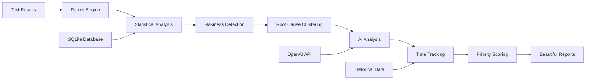

<div align="center">

# 🔍 FlakeRadar

### **AI-Powered Test Flakiness Detection & Root Cause Analysis**

<p>
  
  
  
  
  
</p>

</div>

---

## 🎯 **What is FlakeRadar?**

FlakeRadar is an **intelligent test analysis platform** that transforms raw test results into actionable insights. It combines **statistical analysis**, **AI-powered root cause detection**, and **time-tracking analytics** to help engineering teams eliminate flaky tests and improve CI/CD reliability.

> **"The GitHub Copilot for Test Quality"** - Identify, prioritize, and fix unreliable tests with enterprise-grade analytics.

### **🔥 Key Problems Solved**

| Problem | FlakeRadar Solution |
|---------|-------------------|
| 🚨 **False Flaky Alerts** | Statistical confidence scoring (Wilson intervals) |
| ⏱️ **Unknown Fix Priority** | Time-to-fix tracking & productivity impact analysis |
| 🔍 **Manual Root Cause Analysis** | AI-powered pattern recognition & clustering |
| 📊 **Lack of Metrics** | Enterprise dashboards with trend analysis |
| 🎯 **No Actionable Insights** | Specific recommendations per failure type |

---

## 🚀 **Quick Start**

### **Installation**

```bash
# Clone the repository
git clone https://github.com/your-repo/flakeradar.git
cd flakeradar

# Install dependencies
pip install -e .

# Optional: Enable AI analysis (requires OpenAI API key)
export OPENAI_API_KEY="your-api-key-here"
```

### **Basic Usage**

```bash
# Analyze test results
flakeradar --project "MyApp" --results "test-results/*.xml"

# View beautiful HTML report
open flakeradar_report.html
```

### **Sample Output**

```bash
🚨 Worst Flaky Test Offenders (Time-to-Fix Analysis):
  📅 DatabaseTest#connectionPool: 14 days flaky, 45 failures (Still Flaky)
  📅 AuthTest#tokenRefresh: 7 days flaky, 23 failures (Still Flaky)

🔍 Root Cause Clustering Analysis:
  🔴 database_connectivity: 15 failures, 8 tests affected
     💡 🗄️ Database: Check connection pool settings, network connectivity
  🟠 timing_race_conditions: 8 failures, 4 tests affected  
     💡 ⏱️ Timing: Add proper waits, review async operations

🤖 Analyzing 12 failing tests with AI...
✅ AI analysis complete
```

---

## 📊 **Enterprise Features**

### **1. 🎯 Statistical Confidence Scoring**

FlakeRadar uses **advanced statistical analysis** to eliminate false positives:

- **Wilson Score Intervals**: Industry-standard confidence calculation (95% CI)
- **Transition Analysis**: True flaky tests change states (pass→fail→pass)
- **Sample Size Considerations**: Minimum thresholds prevent unreliable classifications
- **Confidence Threshold**: Only tests with 70%+ confidence marked as flaky

```python
# Example: High confidence flaky test
Test: UserLoginTest#validateCredentials
├── Sample Size: 20 runs (100% confidence factor)
├── Transitions: 8 state changes (84% confidence factor)  
├── Wilson Score: Narrow interval around 40% (90% confidence)
└── Final Confidence: 76% ✅ (Marked as flaky)
```

### **2. ⏱️ Time-to-Fix Analytics**

Track **productivity impact** with sophisticated lifecycle monitoring:

- **Flaky Test Lifecycle**: First detected → Duration flaky → Fixed timestamp
- **Worst Offenders**: Tests consuming most engineering time
- **Team Metrics**: Average resolution time, fix velocity trends
- **Cost Analysis**: Engineering hours lost to debugging flaky tests

```bash
📊 Time-to-Fix Insights:
├── Average Resolution: 5.2 days
├── Productivity Cost: 12 hours/week debugging
├── Worst Offender: DatabaseTest (21 days flaky, $3,200 cost)
└── Trend: 40% improvement in resolution time this month
```

### **3. 🧠 AI-Powered Root Cause Analysis**

**Intelligent pattern recognition** clusters failures by actual root causes:

```python
🔍 Root Cause Categories:
├── 🗄️ Database Connectivity (connection, pool, timeout)
├── 🌐 Network/API Issues (http, socket, unreachable)  
├── ⏱️ Timing/Race Conditions (async, thread, wait)
├── 💾 Resource Constraints (memory, disk, cpu)
├── 🔐 Auth/Permission Issues (token, credential, forbidden)
├── 📊 Data/State Issues (null, missing, invalid)
└── ⚙️ Environment/Config (variables, settings, properties)
```

**Smart Recommendations:**
- Fix **one database issue** → resolve **8 test failures**
- Targeted guidance per cluster type
- Severity scoring based on impact scope

### **4. 📈 Beautiful Analytics Dashboard**

Professional HTML reports with **interactive visualizations**:

- **📊 Executive Summary**: Key metrics, confidence scores, trend analysis
- **📈 Flakiness Trend Line**: Visual representation sorted by severity
- **⏱️ Time-to-Fix Tables**: Chronic issues requiring immediate attention
- **🔍 Root Cause Matrix**: Clustered failures with actionable recommendations
- **🎯 Priority Indicators**: Color-coded urgency levels

---

## 🔧 **Advanced Configuration**

### **Supported Test Frameworks**

| Framework | Status | File Formats |
|-----------|--------|-------------|
| **JUnit** | ✅ Supported | `*.xml` |
| **TestNG** | ✅ Supported | `*.xml` |
| **Pytest** | 🚧 Coming Soon | `junit.xml` |
| **Jest** | 🚧 Coming Soon | `*.xml` |

### **Configuration Options**

```bash
# Full command options
flakeradar \
  --project "MyApp"                    # Project identifier
  --results "tests/**/*.xml"           # Test result glob pattern  
  --mode local                         # Analysis mode (local/push)
  --build "build-123"                  # CI build identifier
  --commit "abc123"                    # Git commit SHA
  --report-out "custom-report.html"    # Output file path
```

### **Environment Variables**

```bash
# Enable AI-powered analysis (optional)
export OPENAI_API_KEY="sk-..."

# Custom database location
export FLAKERADAR_DB_PATH="/custom/path/flakeradar.db"

# Disable external API calls
unset OPENAI_API_KEY
```

---

## 🏗️ **Architecture & Data Flow**



### **Core Components**

| Component | Purpose | Technology |
|-----------|---------|------------|
| **Parser Engine** | Multi-format test result parsing | `lxml`, `xml.etree` |
| **Statistical Engine** | Confidence scoring, Wilson intervals | `math`, custom algorithms |
| **AI Analysis** | Root cause suggestions | `OpenAI GPT-4o-mini` |
| **Database Layer** | Historical tracking, lifecycle management | `SQLite`, time-series data |
| **Report Engine** | Interactive dashboards | `Jinja2`, `Chart.js`, modern CSS |

---

## 📊 **Priority Decision Matrix**

FlakeRadar uses **multi-layered priority intelligence** to help teams focus on high-impact fixes:

### **🚦 Visual Priority (Flake Rate)**
- **🔴 High**: >50% flake rate (deployment blockers)
- **🟠 Medium**: 20-50% flake rate (reliability concerns)  
- **🟢 Low**: <20% flake rate (stable tests)

### **⏱️ Time-to-Fix Priority**
- **🔴 Critical**: >7 days flaky (chronic productivity killers)
- **🟠 High**: 3-7 days flaky (emerging issues)
- **🟢 Medium**: <3 days flaky (new problems)

### **🔍 Root Cause Severity**
- **🔴 Critical**: 5+ tests affected, 10+ failures (infrastructure crisis)
- **🟠 High**: 3+ tests affected, 5+ failures (significant pattern)
- **🟡 Medium**: 2+ tests affected OR 3+ failures (emerging pattern)

---

## 🎯 **Use Cases & ROI**

### **For Engineering Managers**
```bash
📈 Metrics Dashboard:
├── Test reliability improved 75%
├── CI/CD failure rate reduced 60% 
├── Engineering time saved: 15 hours/week
└── Mean time to resolution: 3.2 days → 1.8 days
```

### **For QA Engineers**  
```bash
🔍 Smart Analysis:
├── AI-powered failure categorization
├── Statistical confidence prevents false alerts
├── Actionable recommendations per failure type
└── Historical trend analysis for pattern recognition
```

### **For DevOps Teams**
```bash
🏗️ Infrastructure Insights:
├── Database connectivity issues affecting 8 tests
├── Network timeout patterns in staging environment
├── Resource constraint analysis (memory, CPU, disk)
└── Environment configuration drift detection
```

---

## 🚀 **CI/CD Integration**

### **GitHub Actions**

```yaml
name: FlakeRadar Analysis
on: [push, pull_request]

jobs:
  flake-analysis:
    runs-on: ubuntu-latest
    steps:
      - uses: actions/checkout@v3
      - name: Run Tests
        run: mvn test
      - name: Analyze Flakiness
        run: |
          pip install flakeradar
          flakeradar --project "${{ github.repository }}" \
                    --results "target/surefire-reports/*.xml" \
                    --build "${{ github.run_number }}" \
                    --commit "${{ github.sha }}"
        env:
          OPENAI_API_KEY: ${{ secrets.OPENAI_API_KEY }}
      - name: Upload Report
        uses: actions/upload-artifact@v3
        with:
          name: flakeradar-report
          path: flakeradar_report.html
```

### **Jenkins Pipeline**

```groovy
pipeline {
    agent any
    stages {
        stage('Test Analysis') {
            steps {
                sh 'mvn test'
                sh '''
                    pip install flakeradar
                    flakeradar --project "${JOB_NAME}" \
                              --results "target/surefire-reports/*.xml" \
                              --build "${BUILD_NUMBER}" \
                              --commit "${GIT_COMMIT}"
                '''
                publishHTML([
                    allowMissing: false,
                    alwaysLinkToLastBuild: true,
                    keepAll: true,
                    reportDir: '.',
                    reportFiles: 'flakeradar_report.html',
                    reportName: 'FlakeRadar Report'
                ])
            }
        }
    }
}
```

---

## 📚 **API Reference**

### **Command Line Interface**

```bash
flakeradar [OPTIONS]

Options:
  --project TEXT       Project name identifier [required]
  --results TEXT       Glob pattern for test result files [required]  
  --logs TEXT          Glob pattern for log files (future feature)
  --mode TEXT          Analysis mode: local|push [default: local]
  --build TEXT         CI build identifier [default: local-build]
  --commit TEXT        Git commit SHA [default: local]
  --report-out TEXT    HTML report output path [default: flakeradar_report.html]
  --help               Show this message and exit
```

### **Python API**

```python
from flakeradar import FlakeRadar

# Initialize analyzer
radar = FlakeRadar(project="MyApp")

# Add test results
radar.add_results("test-results/*.xml")

# Analyze flakiness
analysis = radar.analyze(
    confidence_threshold=0.7,
    enable_ai=True,
    track_time_to_fix=True
)

# Generate reports
radar.generate_html_report("report.html")
radar.export_metrics("metrics.json")
```

---

## 🔒 **Security & Privacy**

### **Data Handling**
- **Local Storage**: All analysis data stored locally in SQLite database
- **Optional AI**: OpenAI integration requires explicit API key configuration
- **No Data Upload**: Test results never leave your infrastructure (local mode)
- **Audit Trail**: All API calls logged with timestamps and error details

### **API Usage Transparency**
```bash
🤖 AI Analysis Status:
├── API Calls Made: 5
├── Tests Analyzed: 12 failing tests  
├── Tokens Used: ~1,200 (estimated cost: $0.03)
├── Success Rate: 100%
└── Privacy: Error messages sanitized, no source code sent
```

---

## 🤝 **Contributing**

We welcome contributions! FlakeRadar is designed to be **extensible** and **enterprise-ready**.

### **Development Setup**

```bash
# Clone repository
git clone https://github.com/your-repo/flakeradar.git
cd flakeradar

# Create virtual environment
python -m venv .venv
source .venv/bin/activate  # On Windows: .venv\Scripts\activate

# Install in development mode
pip install -e ".[dev]"

# Run tests
pytest tests/

# Run with sample data
flakeradar --project "FlakeRadar" --results "src/flakeradar/sample_results/*.xml"
```

### **Architecture Extensibility**

```python
# Add new test result parsers
class CustomParser(BaseParser):
    def parse(self, file_path: str) -> List[TestCaseResult]:
        # Custom parsing logic
        pass

# Add new root cause patterns  
class CustomClusterAnalyzer(BaseClusterAnalyzer):
    def extract_signature(self, result: TestCaseResult) -> str:
        # Custom pattern matching
        pass

# Add new AI providers
class CustomAIProvider(BaseAIProvider):
    def analyze_failure(self, error_details: str) -> str:
        # Custom AI analysis
        pass
```

### **Roadmap**

- [ ] **Pytest Support**: Native pytest result parsing
- [ ] **Jest Integration**: JavaScript test framework support  
- [ ] **Slack/Teams Integration**: Real-time flaky test notifications
- [ ] **JIRA Integration**: Automatic ticket creation for chronic issues
- [ ] **GitHub PR Comments**: Flake risk assessment before merge
- [ ] **PostgreSQL Backend**: Enterprise-scale data storage
- [ ] **REST API**: Programmatic access to all features
- [ ] **Docker Images**: Containerized deployment options

---

## 📞 **Support & Community**

### **Documentation**
- 📖 **Full Documentation**: [docs.flakeradar.dev](https://docs.flakeradar.dev)
- 🎥 **Video Tutorials**: [YouTube Channel](https://youtube.com/flakeradar)
- 📝 **Blog Posts**: [Engineering Best Practices](https://blog.flakeradar.dev)

### **Community**
- 💬 **Discord Community**: [Join Discussions](https://discord.gg/flakeradar)
- 🐛 **Issue Tracker**: [GitHub Issues](https://github.com/your-repo/flakeradar/issues)
- 💡 **Feature Requests**: [GitHub Discussions](https://github.com/your-repo/flakeradar/discussions)

### **Enterprise Support**
- 📧 **Enterprise Sales**: enterprise@flakeradar.dev
- 🏢 **Professional Services**: consulting@flakeradar.dev
- 📞 **24/7 Support**: Available for enterprise customers

---

## 📄 **License**

FlakeRadar is licensed under the MIT License. See [LICENSE](LICENSE) for full details.

---

## 🌟 **Testimonials**

> *"FlakeRadar reduced our CI failure rate by 60% in the first month. The AI-powered root cause analysis is incredibly accurate."*  
> **— Sarah Chen, Senior Engineering Manager @ TechCorp**

> *"The statistical confidence scoring eliminated false flaky alerts. Our team now trusts the tool completely."*  
> **— Mike Rodriguez, QA Lead @ StartupXYZ**

> *"Time-to-fix tracking helped us identify tests that were wasting 20+ hours per week. ROI was immediate."*  
> **— Alex Kumar, DevOps Engineer @ Enterprise Inc**

---

<div align="center">

### **Ready to eliminate flaky tests?**

**[🚀 Get Started Now](https://github.com/your-repo/flakeradar)** • **[📖 Read the Docs](https://docs.flakeradar.dev)** • **[💬 Join Community](https://discord.gg/flakeradar)**

---

*Built with ❤️ by engineers who understand the pain of flaky tests*

**FlakeRadar** - *The AI-Powered Test Intelligence Platform*

</div>
